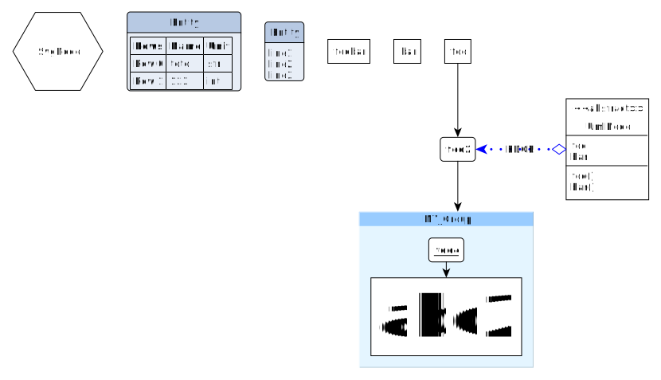

.. _installation:

How to install
------------------
The latest version of this software can be retrieved from the repository hosted at:
https://github.com/ccossou/pyed

This package is a simple Python module, and all default commands
works, such as:

..  code-block:: console

    pip install pyed

How to make a graph
-----------------------
Pyed will not create a ready to use graph. You'll have to do some steps manually in `Yed <https://www.yworks.com/products/yed>`_, but the node creation will be handled in Python completely.

   Example of graph to showcase possible objects. Script used to make the plot is examples/make_graph.py.

Steps to make a graph:

#.  Write a python script to create the .graphml file with every node and edge you can wish for (see *examples/make_graph.py* for a start)

    ..  code-block:: python

        import pyed

        g = pyed.Graph()

        n1 = g.add_node(pyed.ShapeNode, 'foo')
        n2 = g.add_node(pyed.ShapeNode, 'foo2')

        e1 = g.add_edge(n1, n2)

        l = g.add_node(pyed.GenericNode, "Entity", description="line1\nline2\nline3")

        table = [
            ("Rows", "Name", "Unit"),
            ("Row 0", "toto", "str"),
            ("Row 1", 123, "int"),
        ]

        t = g.add_node(pyed.TableNode, "Entity", table=table)

        grp1 = g.add_group("MY_Group")
        n4 = grp1.add_node(pyed.ShapeNode, 'foo4')
        n5 = grp1.add_node(pyed.ShapeNode, 'abc2')

        g.add_edge(n4, n5)
        g.add_edge(n2, grp1)

        g.write_graph("test.graphml")
#. Open the .graphml file you produced in `Yed <https://www.yworks.com/products/yed>`_
    #.  do Tools>Fit Node to Label

        .. note::

            Depending on your need, in the opened window, you might have to uncheck "Ignore Height" to ensure the node adapt properly to your content.
    #. In the Layout menu, use one of the layouts available to properly display the nodes that are currently overlapping one another. A good start is to use either "One Click Layout" or "Hierarchical".
#. You can then save and export to .svg if you want to display this graph in one of your document (other export format are available.)