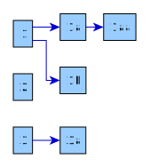

Parsers
===========

yaml_to_graph
-------------

Example input file:

..  code-block::

    1:
        1a:
            1aa:
        1b:
    2:
    3:
        3a:

How to run the code:

..  code-block:: python

    import pyed

    filename = "dict.yaml"

    pyed.yaml_to_graph(filename)

   Example of output graph from the **yaml_to_graph** parser. Script used to make the plot is ``examples/make_yaml_graph.py``.