Xml Elements
===========

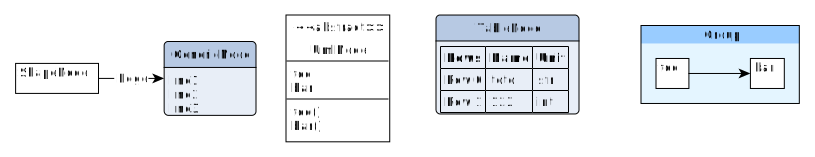

   All possible Elements available in Pyed. Node title correspond to the class name (ShapeNode, UmlNode, GenericNode, TableNode, Edge, Group). Script used to make the plot is *examples/plot_nodetypes.py*.

Nodes
----------------
.. _Node:
Global parameters for all xxxNode
~~~~~~~~~~~~~~~~~~~~~~

.. _node_parameters:
.. list-table:: Generic parameters applicable for all xxxNode:
   :header-rows: 1

   * - Parameter Name
     - Description
   * - name
     - Node name (title)
   * - title_style
     - dict of all values passed to the title label (see :ref:`label_parameters`)
   * - background
     - Background color as RGB (e.g. '#ffffff') or None if no color
   * - transparent
     - Is the node transparent? 'true' or 'false'
   * - border_color
     - Border color as RGB (e.g. '#ffffff') or None if no color
   * - border_type
     - Border type (e.g. line, the default) (see :ref:`arrowhead`)
   * - border_width
     - Border width in pixel (e.g. '1.0')
   * - height
     - advanced parameters not used by default (expect a float as string)
   * - width
     - advanced parameters not used by default (expect a float as string)
   * - x
     - advanced parameters not used by default (expect a float as string)
   * - y
     - advanced parameters not used by default (expect a float as string)
   * - description
     - Node description (not displayed in Yed, so I don't know how usefull this is)
   * - url
     - Node url (not displayed in Yed, so I don't know how usefull this is)

ShapeNode
~~~~~~~~~~~~~~~~~~~~~~
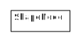

   Example of ShapeNode. Script used to make the plot is examples/plot_indiv_element.py.

..  code-block:: python

    import pyed

    g = pyed.Graph()

    g.add_node(pyed.ShapeNode, "foo")

.. list-table:: ShapeNode parameters (see :ref:`node_parameters` for common parameters also applicable):
   :header-rows: 1

   * - Parameter Name
     - Possible values
     - Description
   * - shape
     - ['rectangle', 'rectangle3d', 'roundrectangle', 'diamond', 'ellipse',
                   'fatarrow', 'fatarrow2', 'hexagon', 'octagon', 'parallelogram',
                   'parallelogram2', 'star5', 'star6', 'star6', 'star8', 'trapezoid',
                   'trapezoid2', 'triangle', 'trapezoid2', 'triangle']
     - Shape of the Node (by default, rectangle) (see :ref:`shape`)

.. _shape:
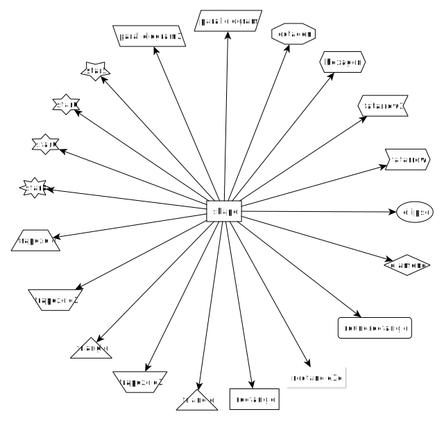

   shape for ShapeNode or Group. Script used to make the plot is examples/plot_node_shape.py.

UmlNode
~~~~~~~~~~~~~~~~~~~~~~
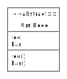

   Example of UmlNode. Script used to make the plot is examples/plot_indiv_element.py.

..  code-block:: python

    import pyed

    g = pyed.Graph()

    n3 = g.add_node(pyed.UmlNode, "UmlNode", stereotype="abstract", attributes="foo\nbar", methods="foo()\nbar()")

.. list-table:: UmlNode parameters (see :ref:`node_parameters` for common parameters also applicable):
   :header-rows: 1

   * - Parameter Name
     - Possible values
     - Description
   * - stereotype
     - text (or empty string)
     - Class stereotype (e.g. AbstractClass)
   * - attributes
     - text (or empty string)
     - Class attributes
   * - methods
     - text (or empty string)
     - Class methods

.. _table_node:
TableNode
~~~~~~~~~~~~~~~~~~~~~~
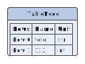

   Example of TableNode. Script used to make the plot is examples/plot_indiv_element.py.

..  code-block:: python

    import pyed

    g = pyed.Graph()

    table = [
        ("Rows", "Name", "Unit"),
        ("Row 0", "toto", "str"),
        ("Row 1", 123, "int"),
    ]

    t = g.add_node(pyed.TableNode, "TableNode", table=table)

.. list-table:: TableNode parameters (see :ref:`node_parameters` for common parameters also applicable):
   :header-rows: 1

   * - Parameter Name
     - Possible values
     - Description
   * - table
     - list(tuple(str))
     - Each tuple is a line, each item in tuple is a cell. First line is the header
   * - table_style
     - dict
     - dict of all values passed to the table label (see :ref:`label_parameters`)

.. _generic_node:
GenericNode
~~~~~~~~~~~~~~~~~~~~~~
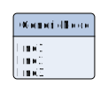

   Example of GenericNode. Script used to make the plot is examples/plot_indiv_element.py.

..  code-block:: python

    import pyed

    g = pyed.Graph()

    l = g.add_node(pyed.GenericNode, "GenericNode", description="line1\nline2\nline3")

.. list-table:: GenericNode parameters (see :ref:`node_parameters` for common parameters also applicable):
   :header-rows: 1

   * - Parameter Name
     - Possible values
     - Description
   * - description
     - str
     - Description text
   * - desc_style
     - dict
     - dict of all values passed to the description label (see :ref:`label_parameters`)

.. _svg_node:
SvgNode
~~~~~~~~~~~~~~~~~~~~~~
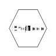

   Example of SvgNode. Script used to make the plot is examples/plot_indiv_element.py.

..  code-block:: python

    import pyed

    g = pyed.Graph()

    n = g.add_node(pyed.SvgNode, "SvgNode", svg_filename="yed_regular_hexagon.svg")

.. list-table:: GenericNode parameters (see :ref:`node_parameters` for common parameters also applicable):
   :header-rows: 1

   * - Parameter Name
     - Possible values
     - Description
   * - svg_filename
     - str
     - Absolute or relative path to an SVG file that will be used as node representation.

In Yed, you have an option menu:SVG[Apply SVG size], to make sure the ratio if kept, but this is a one time only option. If you resize, that option is deactivated because you can only keep the original SVG size, and not the original ratio. You can, however, resize while pressing btn:[Shift]. Another option is to set *width* and *height* when defining the *SvgNode*.

Edge
----------------
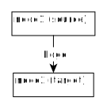

   Example of Edge. Script used to make the plot is examples/plot_indiv_element.py.

..  code-block:: python

    import pyed

    g = pyed.Graph()

    n1 = g.add_node(pyed.ShapeNode, 'node1 (source)')
    n2 = g.add_node(pyed.ShapeNode, 'node2 (target)')

    e1 = g.add_edge(n1, n2, label="Edge", label_style={"backgroundColor": "#ffffff"})

.. list-table:: Parameters for an Edge:
   :header-rows: 1

   * - Parameter Name
     - Description
   * - node1
     - Source node object
   * - node2
     - Target node object
   * - arrowhead
     - Type of arrow for the target node (see :ref:`arrowhead`)
   * - arrowfoot
     - Type of arrow for the source node (see :ref:`arrowhead`)
   * - label
     - Edge middle label text (no text by default)
   * - source_label
     - Edge source label text (no text by default)
   * - target_label
     - Edge target label text (no text by default)
   * - label_style
     - dict of all values passed to the middle, source or target label (see :ref:`label_parameters`)
   * - background
     - Background color as RGB (e.g. '#ffffff') or None if no color
   * - color
     - Line color as RGB (e.g. '#ffffff') or None if no color
   * - line_type
     - Edge type (e.g. line, the default) (see :ref:`linetype`)
   * - width
     - Edge width in pixel (e.g. '1.0')

   * - description
     - Node description (not displayed in Yed, so I don't know how usefull this is)
   * - url
     - Node url (not displayed in Yed, so I don't know how usefull this is)

.. _linetype:
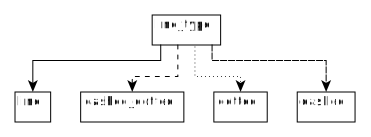

   Line type for edges. Script used to make the plot is examples/plot_edge_linetype.py.

.. _arrowhead:
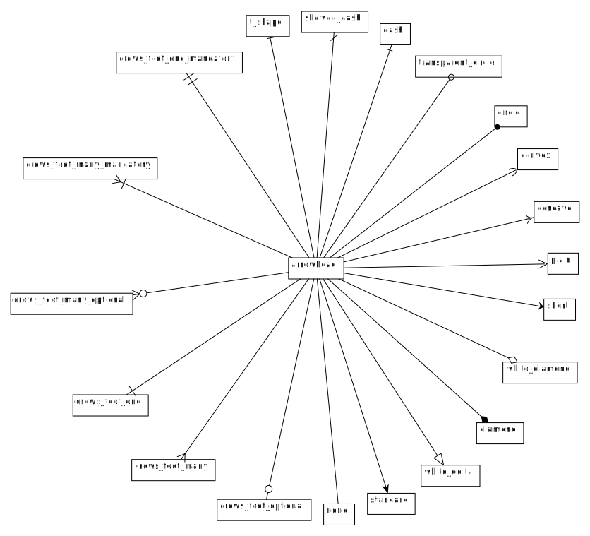

   Arrow type for edges. Script used to make the plot is examples/plot_edge_arrowhead.py.

Group
----------------
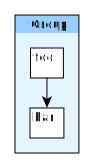

   Example of Group. Script used to make the plot is examples/plot_indiv_element.py.

..  code-block:: python

    import pyed

    g = pyed.Graph()

    grp1 = g.add_group("Group")
    n4 = grp1.add_node(pyed.ShapeNode, 'foo')
    n5 = grp1.add_node(pyed.ShapeNode, 'bar')

    e1 = grp1.add_edge(n4, n5)

    grp2 = grp1.add_group("2nd group")

.. list-table:: Group parameters:
   :header-rows: 1

   * - Parameter Name
     - Possible values
     - Description
   * - name
     - str
     - Node name (title)
   * - shape
     - 'rectangle'
     - Shape of the Group (by default, rectangle) (see :ref:`shape`)
   * - title_style
     - dict
     - dict of all values passed to the title label (see :ref:`label_parameters`)
   * - closed
     - 'true'
     - 'true' or 'false' (no idea what this does)
   * - background
     - None
     - Background color as RGB (e.g. '#ffffff') or None if no color
   * - transparent
     - 'false'
     - Is the node transparent? 'true' or 'false'
   * - border_color
     - '#000000'
     - Border color as RGB (e.g. '#ffffff') or None if no color
   * - border_type
     - 'line'
     - Border type (e.g. line, the default) (see :ref:`arrowhead`)
   * - border_width
     - '1.0'
     - Border width in pixel (e.g. '1.0')
   * - height
     - '30.0'
     - advanced parameters not used by default (expect a float as string)
   * - width
     - '60.0'
     - advanced parameters not used by default (expect a float as string)
   * - x
     - None
     - advanced parameters not used by default (expect a float as string)
   * - y
     - None
     - advanced parameters not used by default (expect a float as string)
   * - description
     - ''
     - Node description (not displayed in Yed, so I don't know how usefull this is)
   * - url
     - ''
     - Node url (not displayed in Yed, so I don't know how usefull this is)

.. _Label:
Label
----------------
This is not a proper element per say, but will be used in all other classes. Every node title, edge label (middle, source and target), description in GenericNode and table in TableNode uses Label under the hood.

NOTE: All these parameters only have an effect inside the Label, and have no effect on the Node the Label is placed in.

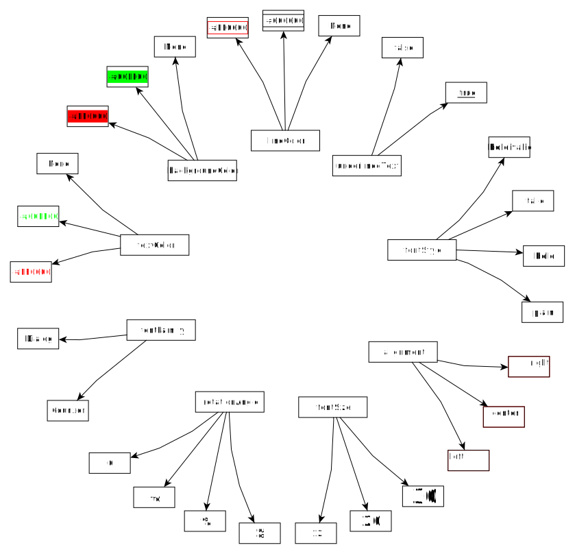

   Main Label parameters one can use. For alignment, ``autoSizePolicy="node_size"`` was used. Script used to make the plot is *examples/plot_label_parameters.py*.

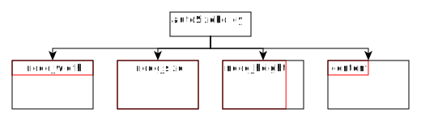

   Label ``autoSizePolicy`` values. Script used to make the plot is *examples/plot_label_size.py*.

Example on how to apply those parameter in an actual node:

..  code-block:: python

    g.add_node(pyed.ShapeNode, "foo", title_style=dict(fontFamily="Dialog",
    rotationAngle="60", underlinedText="true", lineColor=None))

.. _label_parameters:
.. list-table:: Label parameters
   :header-rows: 1

   * - Name
     - Example
     - Possible values
   * - alignment
     - 'center'
     - ['left', 'center', 'right']
   * - fontStyle
     - 'plain'
     - ['plain', 'bold', 'italic', 'bolditalic']
   * - underlinedText
     - 'true'
     - ['true', 'false']
   * - lineColor
     - '#FFde78'
     - None or a color
   * - backgroundColor
     - '#FFde78'
     - None or a color
   * - textColor
     - '#FFde78'
     - None or a color
   * - fontFamily
     - 'Courier'
     - Font name (don't have a full list)
   * - rotationAngle
     - '30'
     - rotation in degrees from 0 to 360
   * - fontSize
     - '20'
     - positive integer
   * - autoSizePolicy
     - 'content'
     - ['node_width', 'node_size', 'node_height', 'content'] (will not work for labels in an edge)

Label placement for every element but Edge)
~~~~~~~~~~~~~~~~~~~~~~
Every element but Edge mean: Group, ShapeNode, UmlNode, GenericNode and TableNode.

These parameters have an effect on how the Label will be placed with respect to the Node. To that extent, the Label parameter autoSizePolicy do matter (at least for all object except Edge, see :ref:`EdgeLabel`)

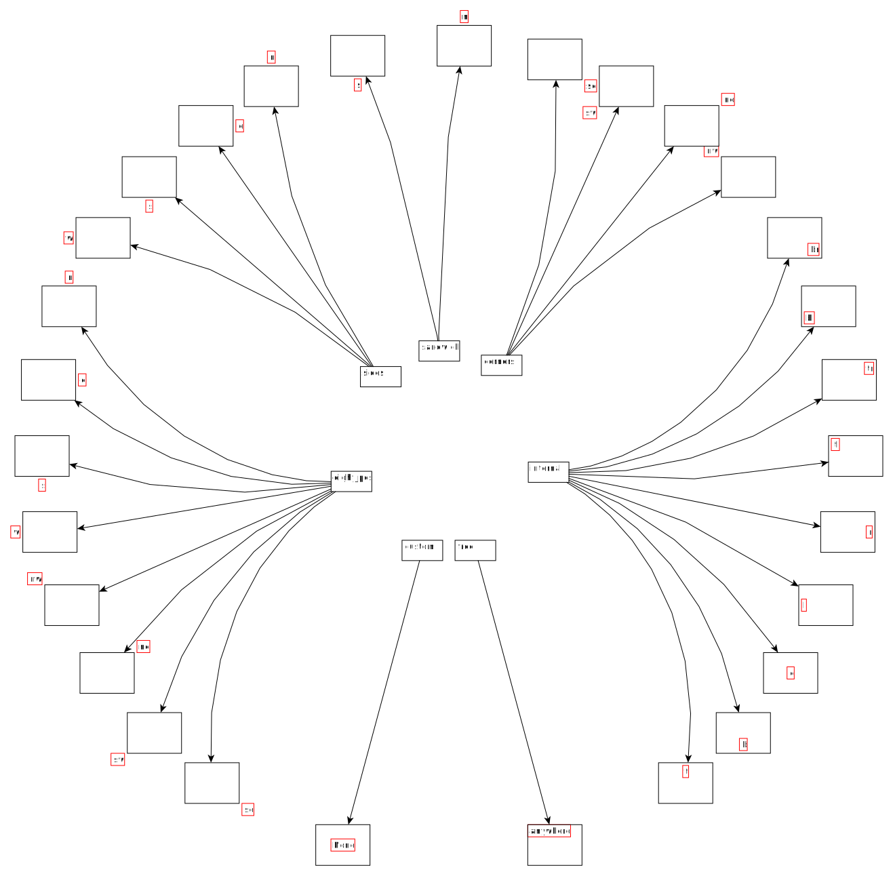

   Label placement for every Element but Edge. Parent node is value for "*modelName*", child node is value for "*modelPosition*". Script used to make the plot is examples/plot_label_placement.py.

..  code-block:: python

    g.add_node(pyed.ShapeNode, "foo", title_style={"modelName": "internal", "modelPosition": "t"})

.. list-table:: Placement (*modelPosition*) parameters for ShapeNode, Group, UmlNode, GenericNode and TableNode (every element but Edge) depending on the model (*modelName*) selected:
   :header-rows: 1

   * - ``modelName``
     - ``modelPosition`` Possible values
   * - internal
     - ['t', 'b', 'c', 'l', 'r', 'tl', 'tr', 'bl', 'br']
   * - corners
     - ['nw', 'ne', 'sw', 'se']
   * - sandwich
     - ['n', 's']
   * - sides
     - ['n', 'e', 's', 'w']
   * - eight_pos
     - ['n', 'e', 's', 'w', 'nw', 'ne', 'sw', 'se']
   * - custom
     - None
   * - free
     - 'anywhere'

.. _EdgeLabel:
Label placement for Edge
~~~~~~~~~~~~~~~~~~~~~~
Parameter *autoSizePolicy* is not allowed for Label on an Edge

.. list-table:: Placement (*modelPosition*) parameters for Edge only depending on the model (*modelName*) selected:
   :header-rows: 1

   * - ``modelName``
     - ``modelPosition`` Possible values
   * - two_pos
     - ['head', 'tail']
   * - centered
     - ['center']
   * - six_pos
     - ['shead', 'thead', 'head', 'stail', 'ttail', 'tail']
   * - three_center
     - ['center', 'scentr', 'tcentr']
   * - center_slider
     - None
   * - side_slider
     - None
   * - free
     - 'anywhere'

.. note::

   ``center_slider`` and ``side_slider`` are dynamic placement and you'll have to place them manually in Yed later. As the name suggest, with ``center_slider`` you'll have to choose different position on the edge while for ``side_slider`` you'll have to choose positions around the edge (on each side).

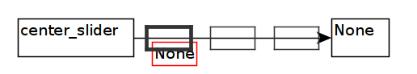

   Edge Label placement with model ``center_slider``.

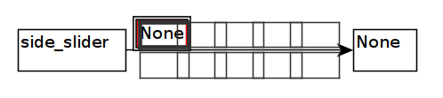

   Edge Label placement with model ``side_slider``.

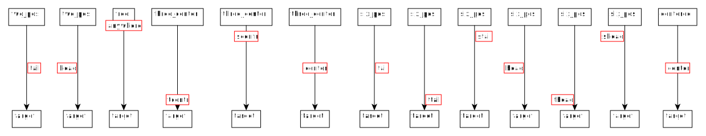

   Label placement for Edge only. Parent node is value for "*modelName*", Edge label is value for "*modelPosition*". Script used to make the plot is examples/plot_edge_label_placement.py.

FAQ
===========
alignment attribute doesn't work
----------------
In Label, alignment has no effect if you have ``autoSizePolicy="content"`` because since the Label tightly fit its content, there's no room for moving the text left or right of the label. You need "*node_size*" or "*node_width*" for alignment to work.
